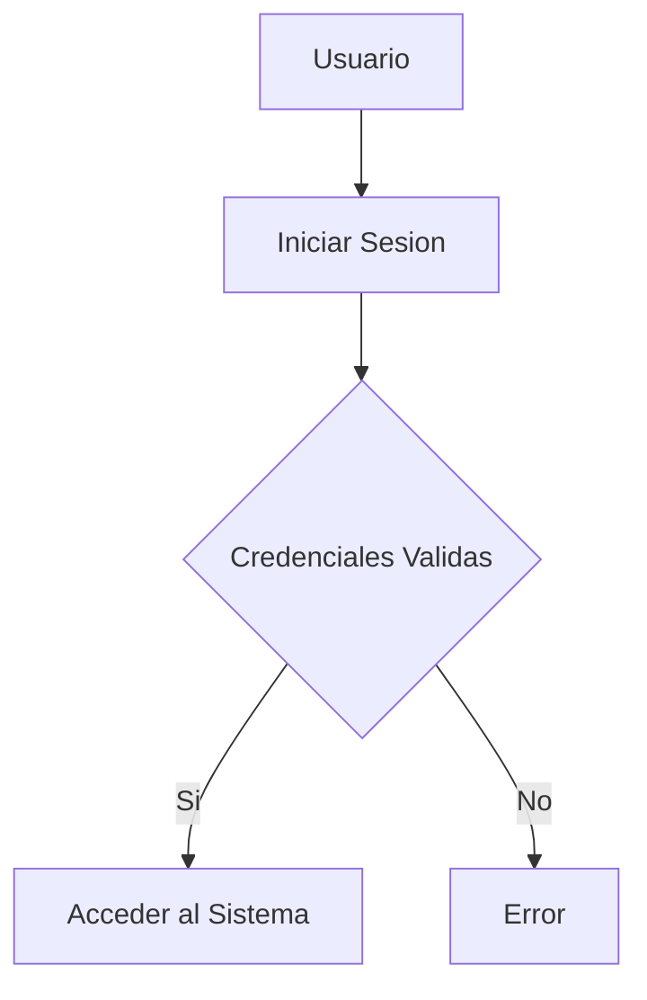
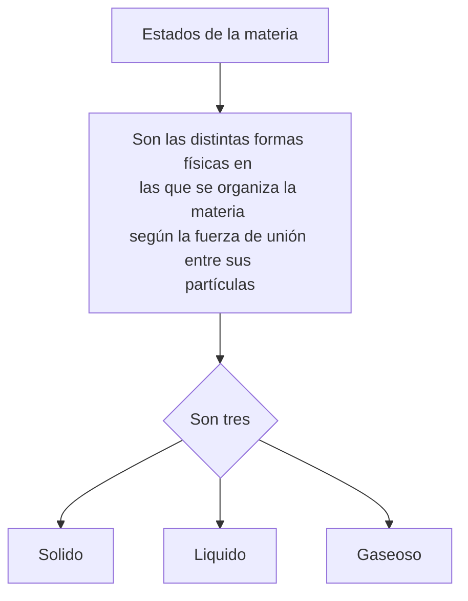

# TABLA DE CONTENIDO
- [Titulo](#titulo-importante)
- [Hipervinculo](#creando-hiperv)
- [Imagenes](#colocar-imagenes)
- [Funciones](#funciones)
- [Tablas](#creando-tablas)

# Titulo importante
Me encuentro aprendiendo *Markdown* en las clases del profesor Luis Pallin.

## Subtitulo 01
Aqui verificamos como formatear diferentes **tipos de texto**.

## Subtitulo 02
Podremos conocer diferentes tipos de formatos de textos usando ~~Markdown~~.

### Creando Hiperv
[Google](https://www.google.com) <br>
[Tecsup](https://www.tecsup.edu.pe)

## Colocar Imagenes


## Funciones
- [X] Registrar Alumno
- [X] Generar Matricula
- [ ] Campo Vacio
- [ ] Libre

## Creando Tablas

| Lenguaje de Programacion | Creador |
| -------------------------| ------- |
| Java | James Cosling | 
| PHP | Rasmus Lerdor |
| Python | Guido Van Rossum |

## Codigo
```html
<h1>Hola Mundo</h1>
```

```css
body{
    background:"red";
}
```

```java
public class Main{
    public static void main(String[] args){
        System.out.println("Hola mundo");
    }
}
```

```javascript
console.log("hola mundo");
```

```python
print("Hola mundo");
```

## Diagrama de Flujo Mermaid


## Diagrama de Flujo de Estados de la Materia


